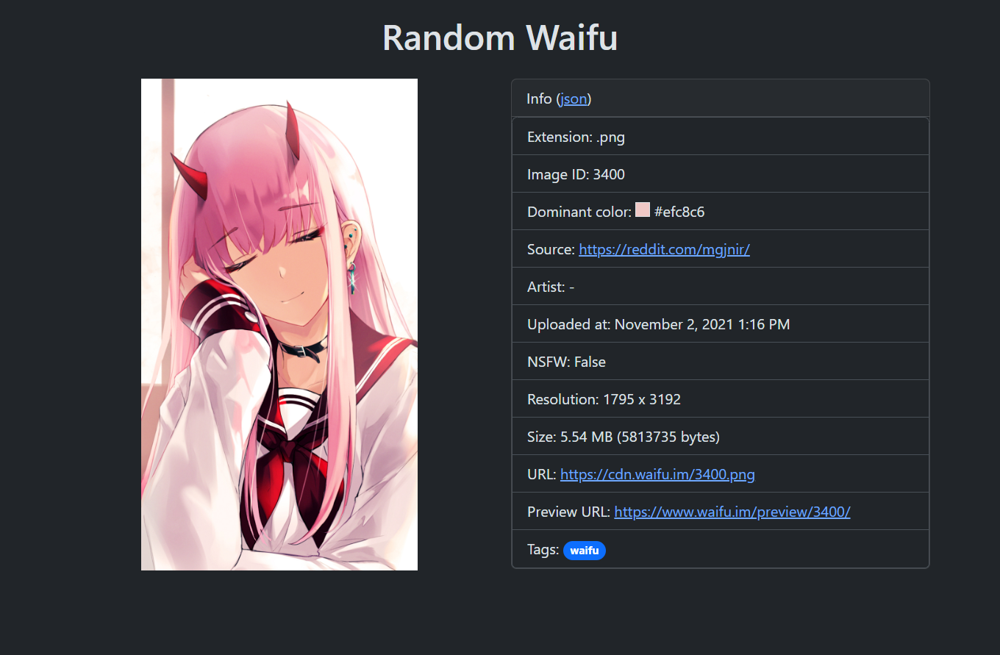

# Random Waifu

A Flask application to fetch random waifu images from [waifu.im](https://www.waifu.im/).



## Installation

Clone the repo:

```
git clone https://github.com/katolik163/randomwaifu.git
cd randomwaifu
```

Create and activate virtual environment then install dependencies:

```
py -m venv .venv
.venv/Scripts/activate
pip install -r requirements.txt
```

Run application:

```
flask run --host 0.0.0.0 --port 80 --debug
```
